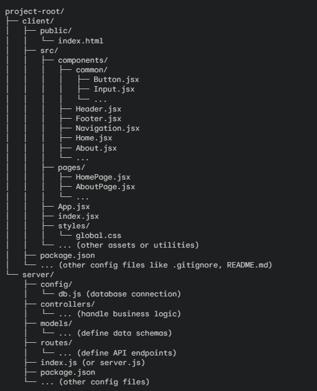

# Development Log

*This document tracks the work done on the Tristate Paper website repository.*

## Table of Contents

1. [Technologies/Dependencies](#technologiesdependencies)
    - [Tech Stack](#tech-stack)
        - [Frontend](#frontend)
        - [Backend](#backend)
    - [Dependencies](#dependencies)
        - [Frontend](#frontend-1)
        - [Backend](#backend-1)
        - [Development Tools](#development-tools)
2. [Entries](#entries)
    - [Date: 2024-09-21](#date-2024-09-21)
    - [Empty Entry](#date-yyyy-mm-dd)
3. [Summary](#summary)
4. [Folder Structure](#folder-structure)

## **Technologies/Dependencies**

### Tech Stack:

- #### Frontend
    - React
    - HTML/CSS (or a CSS framework like Tailwind CSS, Bootstrap, or Material-UI)

- #### Backend
    - Node.js
    - Express.js
    - MongoDB

### Dependencies:

- #### Frontend
    - `react`: Core React library
    - `react-dom`: For rendering React components in the browser
    - `react-router-dom`: For handling client-side routing
    - `axios` or `fetch`: For making HTTP requests to the backend API
    - Additional libraries as needed (e.g., for state management, form handling, UI components, etc.)

- #### Backend
    - `express`: Web framework for Node.js
    - `mongoose`: Object Document Mapper (ODM) for interacting with MongoDB
    - `cors`: Middleware for enabling Cross-Origin Resource Sharing
    - `dotenv`: For loading environment variables from a .env file
    - `body-parser` or similar middleware: For parsing incoming request bodies
    - Additional libraries as needed (e.g., for authentication, file uploads, etc.)

- #### Development Tools
    - **Package Manager:** npm
    - **Version Control:** Git
    - **Code Editor:** VSCode
    - **Deployment Platform:** DigitalOcean

## Entries

### [Date: 2024-09-21]
**Task:**
- Setup basic structure of repository and simple, locally-hosted landing page.

**Details:**
1. Project Setup
    - Create a GitHub Repository (already completed).
    - Set up MERN project in VSCode:
        - Create the basic project structure:
            - `client` folder for the React frontend
            - `server` folder for the Node.js/Express backend
            - `z_misc` folder for miscellaneous content ex. `DevLog.md` ("z_" for sorting folders)
    - Install dependencies:
        - In the client folder, ran `npm install react react-dom`
        - In the server folder, ran `npm install express mongoose cors dotenv`
2. Basic Frontend Structure
    - Create basic components:
        - Inside `client/src`, starting to create basic React components based on Figma design (e.g., Header, Footer, Navigation, Hero section, About section, etc.).
        - Using functional components and JSX to structure layout.
        - Focusing on getting the basic structure and hierarchy in place, referencing wireframes.
3. Basic Backend Setup
    - Server file:
        - In the `server` folder, created an `index.js` file.
        - Setting up a basic Express server with necessary middleware (e.g., `cors`, `body-parser`).
        - Setting up MongoDB instance separately on a cloud provider.
        - Connecting to MongoDB database instance.
4. Connect Frontend and Backend
    - API Routes
        - In the `server` folder, creating routes for handling data fetching and other API requests.
        - Use `fetch` or a library like Axios in React components to make requests to these API endpoints.
5. Version Control with Git
    - Regular Commits with descriptive commit messages (good practice in case anything breaks and needs to be referenced).
    - Pushing to GitHub remote repository to keep it in in sync and create backups.

**Status:**
- In Progress

---

### [Date: YYYY-MM-DD]
**Task:**
- Description of the task completed.

**Details:**
- Additional details or notes about the task.

**Status:**
- Completed / In Progress / Pending

---

## Summary
- Brief summary of the overall progress and any important notes.

## Folder Structure
